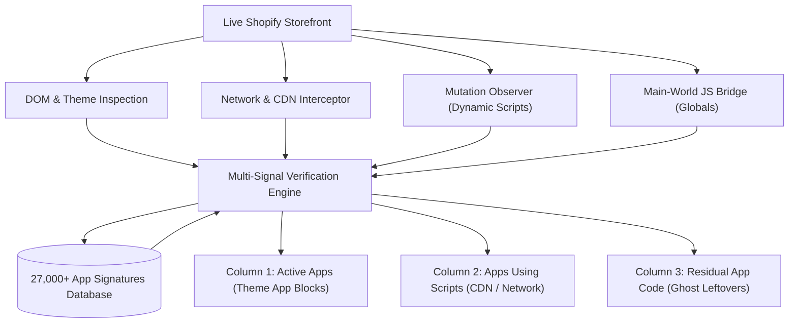

<div align="center">

# Which Shopify App 🛡️

**The definitive, multi-signal Shopify app & theme detector extension for Chrome.**

[](https://chromewebstore.google.com/detail/which-shopify-app)
[](https://apps.shopify.com)
[](https://developer.chrome.com/docs/extensions/mv3/intro/)
[](LICENSE)
[](#-privacy--security)

<br/>

> **Instant Store Intelligence**: Uncover any Shopify store's active apps, background script dependencies, and orphaned residual code left behind by uninstalled apps in seconds.

</div>

---

## 📑 Table of Contents

- [Overview](#-overview)
- [Key Features](#-key-features)
- [How It Works](#-how-it-works)
- [Directory Architecture](#-directory-architecture)
- [Installation](#-installation)
- [Frequently Asked Questions](#-frequently-asked-questions)
- [Privacy & Security](#-privacy--security)
- [License](#-license)

---

## 🌟 Overview

When auditing ecommerce stores, finding out what technology powers a Shopify storefront often involves tedious manual inspection of theme files, network tabs, and messy DOM trees.

**Which Shopify App** automates this completely. Built on a multi-signal detection engine cross-referenced against over **27,000 Shopify applications**, it analyzes live stores in real-time and categorizes findings into a clean, 3-column intelligence dashboard.

```
┌────────────────────────────────────────────────────────────────────────┐
│                        WHICH SHOPIFY APP                               │
│                   store.myshopify.com [COPIED!]                        │
├─────────────────────┬──────────────────────────┬───────────────────────┤
│    ACTIVE APPS      │    APPS USING SCRIPTS    │   RESIDUAL APP CODE   │
│ (Confirmed Active)  │      (CDN / Scripts)     │     (Ghost Code)      │
├─────────────────────┼──────────────────────────┼───────────────────────┤
│ • Klaviyo (App Block)│ • Meta Pixel (ScriptTag) │ • Loox (Old Snippet)  │
│ • Judge.me (Widget) │ • Hotjar (Head Script)   │ • Yotpo (Empty Div)   │
│ • ReCharge (Embed)  │ • Google Tag Manager     │ • Privy (Dead Code)   │
└─────────────────────┴──────────────────────────┴───────────────────────┘
```

---

## 🚀 Key Features

### 1. 📊 3-Column Intelligence Dashboard
* **Active Apps**: Verified live installations actively rendering via Shopify OS 2.0 Theme App Blocks (`shopify://apps/...`), embed blocks, or corroborated DOM components.
* **Apps Using Scripts**: Background scripts, tracking pixels, and headless third-party CDNs actively executing on the storefront.
* **Residual App Code ("Ghosts")**: Orphaned Liquid snippets, abandoned container elements, and dead script tags left behind in the merchant's theme after an app has been uninstalled.

### 2. 🔍 Multi-Signal Precision Verification
Unlike naive scrapers that perform simple string searches, the detection engine correlates multiple independent layers:
* **Shopify Theme App Extensions**: Inspects official OS 2.0 Theme App Block comments and attributes.
* **Network & CDN Fingerprints**: Matches third-party asset requests, script URLs, and proxy routes (`/apps/*`, `/a/*`).
* **Dynamic DOM Mutation Observer**: Watches for asynchronously injected scripts and delayed widget mounts.
* **Main-World JavaScript Bridge**: Safely reads sanitized runtime variables (e.g. `window.Shopify`, `window.klaviyo`, `window.Loox`) via an isolated script bridge.
* **Inline Snippet Inspection**: Scans theme configuration blocks and Liquid snippet artifacts.

### 3. 🏪 Theme & Architecture Insights
* **Theme Name & ID**: Detects the active Shopify theme and build name.
* **MyShopify Identifier Tracker**: Instantly uncovers the original `myshopify.com` domain with 1-click clipboard copy.
* **Architecture Stack Profile**: Classifies high-conversion stacks, subscription architectures, and custom headless builds.

### 4. 📚 Comprehensive 27,000+ App Catalog
The official production extension distributed on the Chrome Web Store bundles detection signatures for the entire catalog of over **27,000 official Shopify App Store applications**, providing instant recognition for apps across all categories: Marketing, Reviews, Fulfillment, Subscriptions, SEO, and Page Builders. *(Note: The open-source repository provides `apps-database.sample.json` as a schema template for contributors).*

### 5. 🔒 100% Client-Side Privacy
* Zero external logging or backend servers.
* All detection and analysis happen entirely in your local browser tab.
* Zero data collection of merchant store data or user activity.

---

## 🛠️ How It Works



---

## 📂 Directory Architecture

The repository adheres to Chrome Extension Manifest V3 best practices with clean modularity:

```text
which-shopify-app/
├── assets/
│   └── icons/
│       ├── app-shield.svg            # Extension action & store icon
│       └── icon.svg                  # Brand vector asset
├── src/
│   ├── background/
│   │   └── background.js             # Service worker, badge counter & tab listener
│   ├── content/
│   │   ├── content.js                # Content script orchestrator
│   │   ├── detector-engine.js        # Multi-signal verification engine
│   │   ├── fingerprint-engine.js     # CDN, proxy & webhook pattern matcher
│   │   ├── injected.js               # Main-world window globals bridge
│   │   └── mutation-detector.js      # Dynamic script injection observer
│   ├── data/
│   │   ├── apps-database.json        # Production catalog (27,000+ apps, private)
│   │   └── apps-database.sample.json # Open-source contributor schema template
│   ├── devtools/
│   │   ├── devtools.html             # DevTools panel wrapper
│   │   └── devtools.js               # Network request listener
│   └── popup/
│       ├── popup.html                # 3-column intelligence dashboard
│       ├── popup.css                 # Standalone CSP-compliant styles
│       └── popup.js                  # UI state management & live rendering
├── .gitignore                        # Git exclusion rules
├── LICENSE                           # MIT License
├── manifest.json                     # Chrome Extension Manifest V3 specification
└── README.md                         # Project documentation
```

---

## 📥 Installation

Install **Which Shopify App** directly from the official **Chrome Web Store**:

[](https://chromewebstore.google.com/detail/which-shopify-app)

👉 **[Download on Chrome Web Store](https://chromewebstore.google.com/detail/which-shopify-app)**

*(Chrome Web Store delivers automated security updates and verified sandboxing.)*

---

## ❓ Frequently Asked Questions

<details>
<summary><strong>What is "Residual App Code" (Ghost Code)?</strong></summary>
When a merchant uninstalls a Shopify app, the app's backend access is revoked, but the code snippets injected into their <code>theme.liquid</code>, templates, or snippet directories often remain behind. These orphaned scripts and CSS files continue to execute, slowing down store load times without providing any function. Which Shopify App flags these so store owners and developers can cleanly purge them.
</details>

<details>
<summary><strong>How is this different from generic tech stack detectors?</strong></summary>
Generic tech stack detectors only look for a few top apps by matching common script URLs. Which Shopify App is purpose-built for Shopify: it understands Shopify OS 2.0 Theme App Extensions, Liquid snippets, proxy paths, and correlates signals against a catalog of 27,000+ Shopify apps to distinguish between active apps and dead code.
</details>

<details>
<summary><strong>Does this extension collect or sell my data?</strong></summary>
No. The extension operates 100% locally on your machine. No URLs, merchant information, or browsing activity are ever transmitted to any server.
</details>

---

## 🛡️ Privacy & Security

* **`activeTab`**: Used solely to analyze the DOM of the active browser tab when you click the extension.
* **`storage`**: Stores local results on your device to display instant audits upon revisiting stores.
* **`scripting`**: Injects the lightweight main-world bridge to read sanitized Shopify theme properties.
* **Zero Telemetry**: No third-party analytics, tracking pixels, or remote logging.

---

## 📄 License

This project is licensed under the [MIT License](LICENSE).
